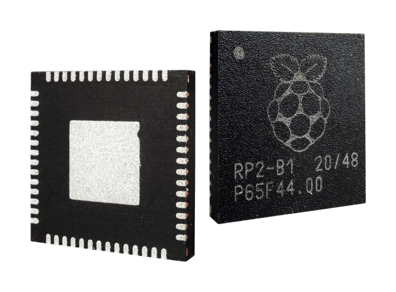

# [RP2040](https://www.soc.xin/RP2040)

* [Raspberry Pi](https://www.raspberrypi.com/)：[Cortex-M0+](https://github.com/SoCXin/Cortex)
* [L2R2](https://github.com/SoCXin/Level)：2x 133 MHz , [￥4.3](https://item.szlcsc.com/2392.html)

## [芯片简介](https://github.com/SoCXin/RP2040/wiki)

[RP2040](https://www.raspberrypi.com/products/raspberry-pi-pico/) 是一款Cortex M0+ 双核MCU，运行频率为 133 MHz (可超频)

### 关键特性

* 133MHz Cortex-M0+ Dual Core
* 264KB RAM + 256KB Flash + 16MB QSPI Flash
* 2 × UART, 2 × SPI , 2 × I2C
* 16 × PWM
* USB1.1 OTG with UF2
* QFN56 (7*7mm), 30 GPIO, 其中的4个可以用于模拟输入
* 8 × PIO可以支持多种IO标准
    * DPI/VGA (利用电阻网络)
    * 8080/6080并行接口
    * SPI/DSPI/QSPI
    * I2C
    * I2S
    * SDIO
    * UART

## [资源整理](https://github.com/SoCXin)

本仓库的目的在于整合所有相关资源，提供高效可靠的开发环境和学习指南。

* [参考资源](src/)
* [参考文档](docs/)
* [工程模板](templates/)

软件开发可使用平台[platform-rp2040](https://github.com/OS-Q/platform-rp2040)

## [选型建议](https://github.com/SoCXin)

2021年1月发布的[RP2040](https://item.szlcsc.com/2392.html)包含两个子系列，分别为支持无晶振USB FS的RP2040xxU系列和不支持USB的RP2040xxN(1.8V-3.6V)/RP2040x4NR(1.8V-5.5V)。

采用TSMC 40nm制程工艺，极端情况下可超频到1GHz，芯片带有4ch 12-bit 500Ksps ADC精度优于ESP32，同时可用于替代早期的ATmega328p，广泛应用于各种外设驱动和通用控制场景。

性价比非常高，价格和[STM32G030C8T6 ￥4.2](https://item.szlcsc.com/2392.html)相当，开源资源丰富，在Arduino和Micropython等生态资源上拥有无与伦比的优势。

RP2040中有2个相同的PIO块,每个PIO块都有专用的连接到总线结构,GPIO和中断控制器,每个块有四个状态机,可以独立执行顺序程序来操作GPIO和传输数据。

与通用处理器不同的是,PIO状态机对IO的专业化程度很高(highly specialised),它注重确定性,精确的时序,并与固定功能硬件紧密结合。PIO状态机可以动态地配置和重新配置,以实现许多不同的接口,自由度很高。

